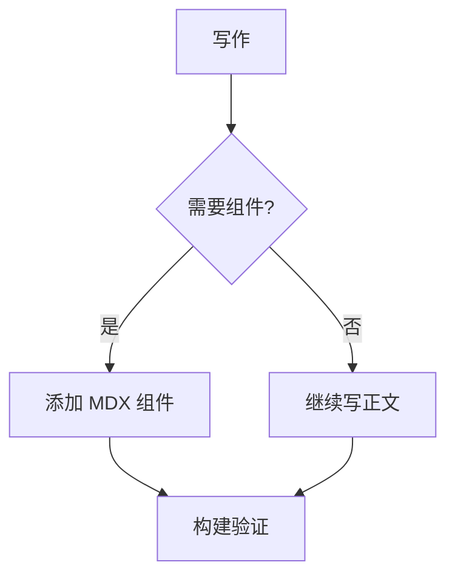

这篇文章只用于检查 todo 样式，不会显示在文章列表里。

## Mermaid

## FileTree

:::filetree[博客项目结构]
src/
  components/
    mdx/
      Callout.astro
      FileTree.astro :: active tag=new desc="当前组件"
      LinkCard.astro
  pages/
    posts/
      [...filename].astro :: desc="文章详情页"
  posts/
    todo-style-test.mdx :: desc="当前测试页"
  styles/ :: closed
    markdown.css
astro.config.mjs :: tag=config desc="Astro 配置"
package.json
public/
  favicon.svg :: icon="mdi:svg"
:::

## Callout

:::tip[写作提示]
这是一段通过 `:::tip` directive 生成的 Astro Callout 组件内容。
:::

:::tip
这是不写标题的 tip，会使用组件里的默认标题。
:::

:::note[普通说明]
这里用于检查 note 类型的标题、图标、背景和正文间距。
:::

:::note
这是不写标题的 note，会使用组件里的默认标题。
:::

:::warning[注意事项]
这里用于检查 warning 类型。它也可以包含 [链接](https://astro.build)、`inline code` 和普通段落。
:::

:::warning
这是不写标题的 warning，会使用组件里的默认标题。
:::

:::danger[危险操作]
这里用于检查 danger 类型的强调程度和警示色。
:::

:::danger
这是不写标题的 danger，会使用组件里的默认标题。
:::

:::info[补充信息]
这里用于检查 info 类型在文章正文中的视觉权重。
:::

:::info
这是不写标题的 info，会使用组件里的默认标题。
:::

## Collapse

:::collapse[为什么用 details 实现？]
`details` 和 `summary` 是浏览器原生的折叠内容语义，默认支持键盘访问，不需要额外客户端状态。

这类内容适合放实现原理、完整配置、可选阅读材料，正文读者可以直接跳过。
:::

:::collapse[默认展开的说明]{open}
这里用于测试 `open` 属性。页面加载时它应该默认展开，但仍然可以手动收起。
:::

## 图片预览

## 基础状态

- [ ] 未完成的单行任务
- [x] 已完成的单行任务
- [ ] 带有 `inline code` 的任务
- [x] 带有 [链接](https://astro.build) 的已完成任务
- [ ] 带有快捷键 <kbd>Ctrl</kbd> + <kbd>K</kbd> 的任务

## 长文本换行

- [ ] 这是一条很长的未完成任务，用来观察文字换行之后 checkbox 是否仍然贴近第一行文字，而不是跑到整个卡片的垂直中心。这里继续补充一些内容，模拟实际写计划、记录问题或拆解需求时出现的长句。
- [x] 这是一条很长的已完成任务，用来观察完成态的划线、文字淡化和背景颜色是否在多行文本下仍然清晰，并且不会让链接、代码或标点显得过于拥挤。

## 嵌套任务

- [ ] 父任务：准备发布
  - [ ] 子任务：检查构建输出
  - [x] 子任务：补充 changelog
  - [ ] 子任务：确认部署环境变量
- [x] 父任务：完成文章排版检查
  - [x] 子任务：检查标题层级
  - [x] 子任务：检查代码块
  - [ ] 子任务：最后确认移动端间距

## 混合列表

- 普通列表项，不应该变成卡片样式
- [ ] todo 列表项，应该有卡片样式
- 普通列表项里带一个普通链接：[Astro](https://astro.build)
- [x] 已完成 todo，应该有勾选和淡化划线

1. 有序列表项
2. 有序列表项后面接 todo：
   - [ ] 嵌在有序列表中的 todo
   - [x] 嵌在有序列表中的已完成 todo

## 段落与子内容

- [ ] 这个任务项下面还有额外说明。

  这段说明用于观察 todo 项内部段落的间距。它应该和任务卡片保持合理关系，不应该把 checkbox 挤到奇怪的位置。

- [x] 这个已完成任务项下面也有额外说明。

  即使任务已完成，说明文字也应该能保持可读，不要被划线影响得太严重。
